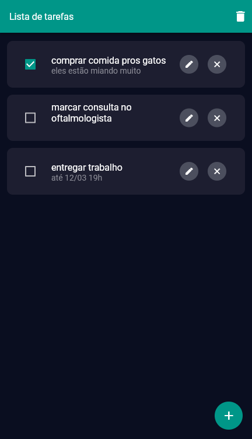

# To-do app para a E-Soft Sistemas

Este é um app feito como parte de um desafio técnico em um processo seletivo para a empresa E-soft Sistemas.

É uma lista de tarefas a serem feitas (to-do list). As tarefas possuem título e descrição (opcional) e podem ser marcadas como feitas via checkbox. É possível editar ou excluir as tarefas.

Os dados são armazenados localmente via biblioteca shared_preferences.

Como o layout e funcionalidades necessárias eram parecidas ao meu outro projeto [Conta Ponto](https://github.com/mattoi/conta-ponto), foi possível reutilizar grande parte do código.

Um dos requerimentos era o gerenciamento de estados usando Bloc, mas infelizmente, como ainda estou no nível de estagiário, e como eu não tenho experiência profissional em projetos grandes, nunca passei pela necessidade de aprender a implementar o Bloc. O tempo para o desafio também foi uma surpresa. O gerenciamento é feito utilizando callbacks ao longo da árvore de Widgets e setState.